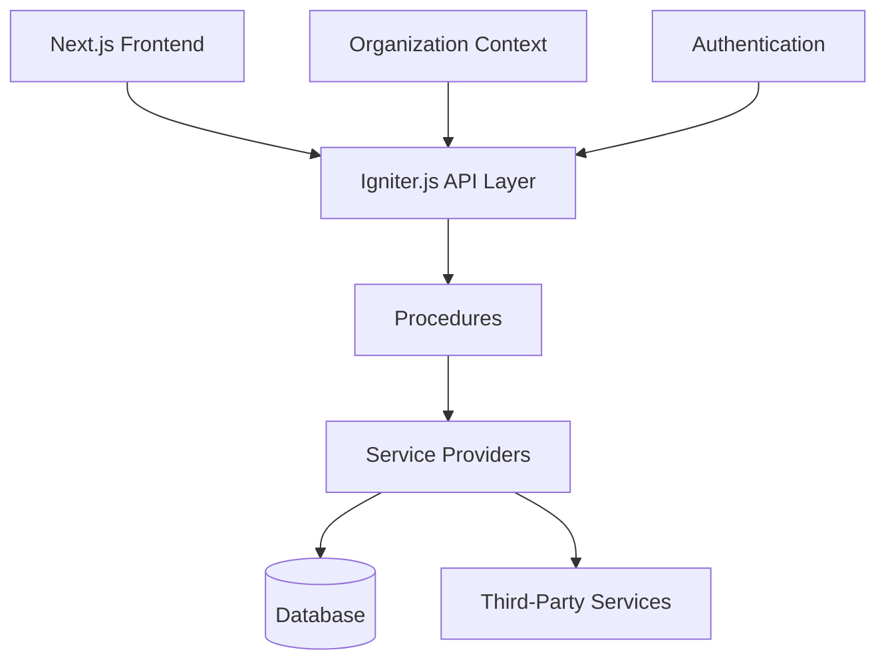

# SaaS Boilerplate

A modern, organization-based, multi-tenant SaaS boilerplate built with Next.js 14, Igniter.js, Prisma, and Shadcn UI.

## 🚀 Features

- ⚡️ **Next.js 14** with App Router
- 🛠 **Igniter.js** for type-safe API development
- 💾 **Prisma** for database management
- 🎨 **Shadcn UI** for beautiful, accessible components
- 🔒 **Authentication** with organization-based multi-tenancy
- 👥 **Role-based access control** (admin, owner, member)
- 💳 **Payments** with Stripe integration
- 📧 **Emails** with React Email
- 📂 **File Storage** with AWS S3
- 📱 **Responsive Design** with Tailwind CSS
- 🌗 **Dark Mode** support
- 📝 **Content Management** with Contentlayer
- 🔍 **SEO** optimized
- 📊 **Analytics** ready
- 🎯 **Feature Flags**
- 🌐 **Internationalization** ready
- 🧪 **Testing** with Vitest

## 📦 Tech Stack

- **Framework:** [Next.js 14](https://nextjs.org)
- **API Layer:** [Igniter.js](https://github.com/felipebarcelospro/igniter)
- **Database:** [Prisma](https://prisma.io)
- **Authentication:** [Better Auth](https://github.com/better-auth/better-auth)
- **UI Components:** [Shadcn UI](https://ui.shadcn.com)
- **Styling:** [Tailwind CSS](https://tailwindcss.com)
- **Forms:** [React Hook Form](https://react-hook-form.com)
- **Validation:** [Zod](https://zod.dev)
- **Emails:** [React Email](https://react.email)
- **Content:** [Contentlayer](https://contentlayer.dev)
- **Testing:** [Vitest](https://vitest.dev)

## 🏗️ Project Structure

```bash
src/
├── app/                       # Next.js App Router entrypoint
│   ├── (api)/                 # API route handlers (Edge/serverless)
│   ├── (auth)/                # Authentication pages (sign-in, sign-up, etc.)
│   ├── (dashboard)/           # Protected, authenticated app pages
│   ├── (site)/                # Public marketing pages
│   └── (components)/          # Shared layout and shell components
├── configs/                   # Application configuration (env, theme, etc.)
├── content/                   # Static content and documentation
│   └── docs/                  # Markdown docs for Contentlayer
├── components/                # UI components (Shadcn UI, custom)
├── hooks/                     # Custom React hooks
├── providers/                 # App-wide providers (theme, auth, etc.)
├── utils/                     # Utility functions and helpers
├── plugins/                   # Third-party or custom plugins
├── features/                  # Domain features (DDD-style)
│   ├── lead/                  # Example feature module
│   │   ├── controllers/       # API controllers (route logic)
│   │   ├── procedures/        # Business logic/middleware
│   │   ├── presentation/      # Feature UI components
│   │   ├── lead.interface.ts  # TypeScript interfaces/types
│   │   └── lead.router.ts     # Feature API route registration
├── @saas-boilerplate/         # Core SaaS modules (importable)
│   ├── features/              # Core features (auth, billing, org, etc.)
│   ├── hooks/                 # Core hooks
│   ├── providers/             # Service providers (db, email, etc.)
│   └── utils/                 # Core utilities
├── igniter.client.ts          # Igniter.js client API config
├── igniter.context.ts         # Igniter.js context (DI, providers)
├── igniter.router.ts          # Igniter.js API router
└── igniter.ts                 # Igniter.js main entrypoint
```

## 🚦 Getting Started

### Prerequisites

- Node.js 18+
- Bun or pnpm
- Docker (for local development)
- AWS Account (for S3)
- Stripe Account (for payments)

### Installation Options

#### Option 1: Using the CLI (Recommended)

The easiest way to get started is using our CLI, which will guide you through the setup process:

```bash
npx saas-boilerplate create my-saas-app --beta
```

Replace `my-saas-app` with your project name. The CLI will:

1. Create a new directory with your project name
2. Set up the boilerplate with all dependencies
3. Configure initial environment variables
4. Guide you through the remaining setup steps

Simply follow the CLI prompts to complete the installation.

#### Option 2: Cloning the Repository

1. Clone the repository:
```bash
git clone https://github.com/felipebarcelospro/saas-boilerplate
cd saas-boilerplate
```

2. Install dependencies:
```bash
bun install 

npm install --legacy-peer-deps

yarn install
```

3. Copy the environment variables:
```bash
cp .env.example .env
```

4. Start the development database:
```bash
bun docker:up

// or
npm run dev

// or
yarn dev
```

5. Run database migrations:
```bash
bun db:migrate:dev

// or
npm run db:migrate:dev

// or
yarn db:migrate:dev
```

6. Start the development server:
```bash
bun dev

// or
npm run dev

// or
yarn dev
```

Your SaaS Boilerplate application should now be running at [https://localhost:3000](https://localhost:3000).

## 💻 Development

### Working with Igniter.js

Igniter.js provides a feature-based architecture for your application with organization-based multi-tenancy. Here's how to create a new feature:

1. First, define your feature's schema in `prisma/schema.prisma`:
```prisma
model Note {
  id            String      @id @default(cuid())
  title         String
  content       String
  organizationId String
  organization  Organization @relation(fields: [organizationId], references: [id], onDelete: Cascade)
  createdAt     DateTime    @default(now())
  updatedAt     DateTime    @updatedAt

  @@index([organizationId])
}
```

2. Run migrations to update your database:
```bash
bun db:migrate:dev --name add_notes_feature
```

3. Generate the feature using Igniter.js CLI:
```bash
bun igniter generate feature
```
Select the feature from the available options.

4. Define your feature's types in `note.interface.ts`:
```typescript
export interface Note {
  id: string
  title: string
  content: string
  organizationId: string
  createdAt: Date
  updatedAt: Date
}

export interface CreateNoteInput {
  title: string
  content: string
}
```

5. Implement the controller in `controllers/note.controller.ts`:
```typescript
import { igniter } from '@/igniter'

export const NoteController = igniter.controller({
  actions: {
    findMany: igniter.query({
      handler: async ({ response, context }) => {
        // Get authenticated session with organization context
        const auth = await context.auth.getSession({
          requirements: 'authenticated'
        })
        
        // Query notes for the current organization
        const result = await context.note.findMany({ 
          organizationId: auth.organization.id 
        })
        
        return response.success(result)
      }
    }),
    
    create: igniter.mutation({
      handler: async ({ response, request, context }) => {
        // Get authenticated session with organization context
        const auth = await context.auth.getSession({
          requirements: 'authenticated',
          roles: ['admin', 'owner'] // Only admins and owners can create
        })
        
        // Create note in the current organization
        const result = await context.note.create({
          ...request.body,
          organizationId: auth.organization.id
        })
        
        return response.success(result)
      }
    })
  }
})
```

6. Implement the procedure in `procedures/note.procedure.ts`:
```typescript
import { igniter } from '@/igniter'

export const NoteFeatureProcedure = igniter.procedure({
  handler: async (_, { context }) => {
    return {
      note: {
        findMany: async (query) => {
          const result = await context.providers.database.note.findMany({
            where: { organizationId: query.organizationId }
          })
          return result
        },
        
        create: async (data) => {
          const result = await context.providers.database.note.create({
            data
          })
          return result
        }
      }
    }
  }
})
```

7. Use the feature in your React components:

```tsx
// Client-side component
'use client'

import { api } from '@/igniter.client'

export function NotesList() {
  const { data: notes, isLoading } = api.note.findMany.useQuery()

  if (isLoading) return <div>Loading...</div>

  return (
    <div>
      {notes?.map(note => (
        <div key={note.id}>
          <h3>{note.title}</h3>
          <p>{note.content}</p>
        </div>
      ))}
    </div>
  )
}

// Server-side component
import { api } from '@/igniter.server'

export default async function NotesPage() {
  const notes = await api.note.findMany.query()

  return (
    <NotesDataTableProvider initialData={notes.data ?? []}>
      <PageWrapper>
        <PageHeader>
          <PageTitle>Notes</PageTitle>
        </PageHeader>
      </PageWrapper>
    </NotesDataTableProvider>
  )
}
```

### Working with Forms

We use React Hook Form with Zod validation:

```typescript
import { useFormWithZod } from '@/hooks/use-form-with-zod'
import { z } from 'zod'

const schema = z.object({
  name: z.string().min(3, 'Name must be at least 3 characters'),
  email: z.string().email('Invalid email address')
})

export function MyForm() {
  const form = useFormWithZod({
    schema,
    defaultValues: {
      name: '',
      email: ''
    },
    onSubmit: async (values) => {
      // Handle form submission
    }
  })

  return (
    <Form {...form}>
      <form onSubmit={form.onSubmit} className="space-y-4">
        <FormField
          control={form.control}
          name="name"
          render={({ field }) => (
            <FormItem>
              <FormLabel>Name</FormLabel>
              <FormControl>
                <Input {...field} />
              </FormControl>
              <FormMessage />
            </FormItem>
          )}
        />
        {/* More fields */}
      </form>
    </Form>
  )
}
```

### API Design

The boilerplate follows a feature-based API design with organization-based multi-tenancy:

1. **Controllers**: Handle HTTP requests, authentication, and permissions
2. **Procedures**: Implement business logic and interact with providers
3. **Interfaces**: Define types and schemas for the feature
4. **Providers**: Handle database operations and external services

Each feature is scoped to an organization, ensuring proper data isolation in a multi-tenant environment. The authentication system provides role-based access control within organizations.

### Styling Components

We use Tailwind CSS with Shadcn UI components:

```typescript
import { Button } from '@/components/ui/button'
import { Input } from '@/components/ui/input'

export function MyComponent() {
  return (
    <div className="space-y-4 p-4">
      <h2 className="text-2xl font-bold">My Component</h2>
      <Input className="w-full" placeholder="Enter something..." />
      <Button>Click me</Button>
    </div>
  )
}
```

## 🏛 Architectural Overview



### Key Design Decisions

| Decision Area       | Implementation Details                  | Rationale                                                                  |
|---------------------|-----------------------------------------|----------------------------------------------------------------------------|
| Multi-tenancy       | Organization-based Architecture         | Proper data isolation and role-based access within organizations           |
| State Management    | React Query + Context API               | Type-safe data fetching with server state management                       |
| API Security        | Role-based Access Control               | Fine-grained permissions based on user roles within organizations          |
| Error Handling      | Unified Error Responses                 | Consistent error handling across the application                           |
| Payments Engine     | Stripe Integration                      | Industry-standard payment processing with subscription management          |

## 🔗 Provider Compatibility Matrix

| Service Type       | Official Support           | Community Plugins         |
|--------------------|----------------------------|---------------------------|
| Authentication     | Auth0, Clerk               | Supabase, Firebase        |
| Payments           | Stripe, Lemon Squeezy      | Paddle, PayPal            |
| Storage            | AWS S3, Cloudflare R2      | Google Cloud Storage      |
| Email              | Resend, SendGrid           | Postmark, AWS SES         |
| Monitoring         | Sentry, Datadog            | New Relic, Grafana        |

## 🛠 Customization Guide

### Adding a New Payment Provider

1. **Implement the adapter interface:**

```typescript
// src/providers/payment/providers/your-provider.adapter.ts
export class YourPaymentAdapter implements PaymentProviderAdapter {
  async createSubscription(customer: Customer, plan: Plan) {
    // Implementation details here
  }
}
```

2. **Register the provider:**

```typescript
// src/providers/payment/payment.provider.ts
this.registerAdapter('your-provider', YourPaymentAdapter);
```

3. **Update environment variables:**

```typescript
// src/core/env.ts
export const serverSchema = z.object({
  YOUR_PROVIDER_API_KEY: z.string(),
  // other variables...
});
```

## 🤝 Contributing

1. Fork the repository
2. Create your feature branch
3. Commit your changes
4. Push to the branch
5. Open a pull request

## 📄 License

This project is licensed under a Source Available License. See the [LICENSE](./LICENSE) file for details.

### License Summary

- **Commercial Use**: Allowed for unlimited applications
- **Modification**: Allowed for your own use
- **Distribution**: You may distribute applications built with this software
- **Reselling**: Not permitted as a template or part of another product
- **Updates**: One year of updates and support included with purchase
- **Perpetual Use**: Continue using and developing applications even after access period ends

For licensing inquiries, please contact the copyright holder.
# boilerplate
